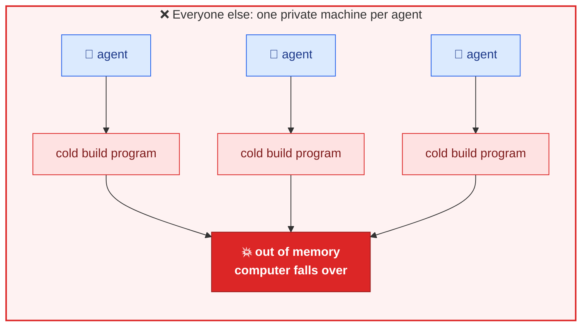
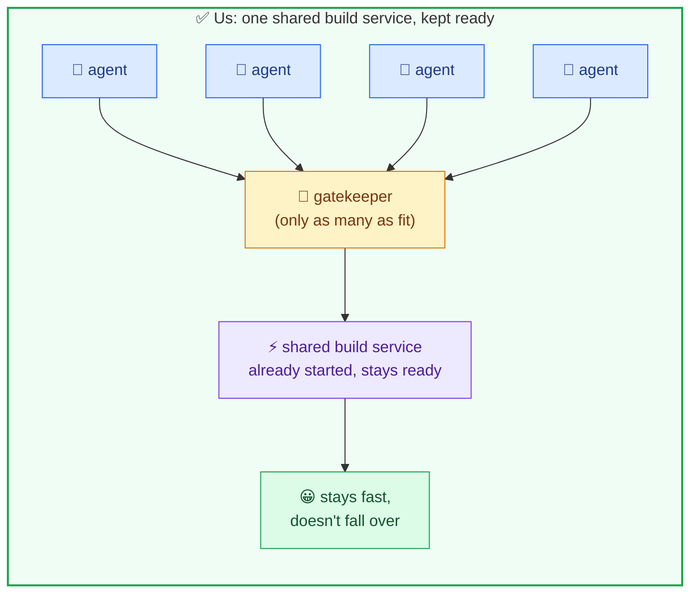
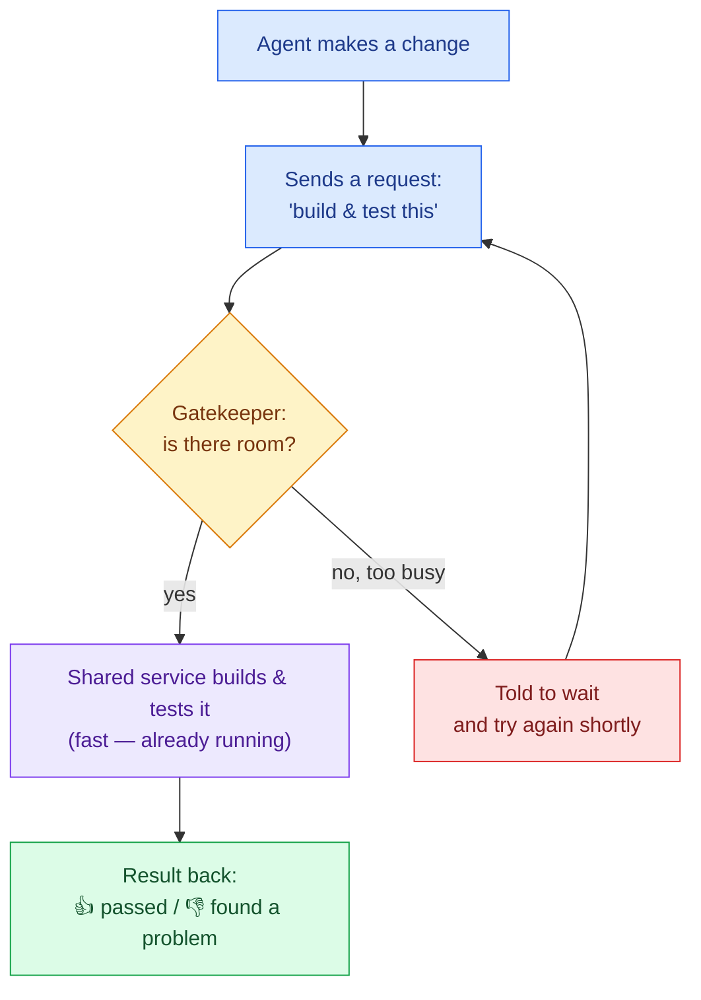
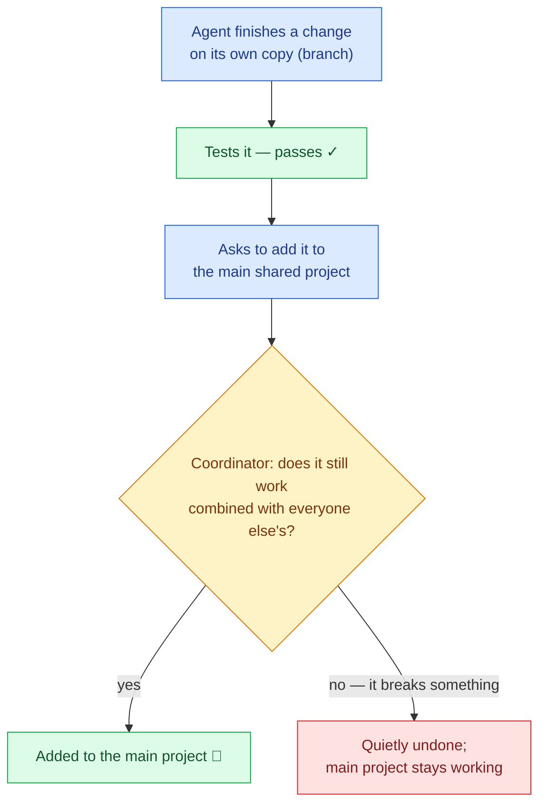
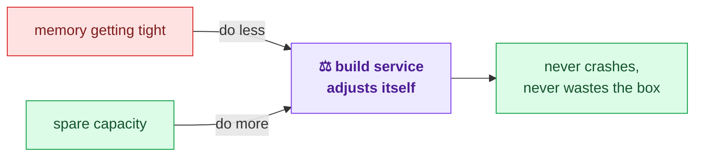
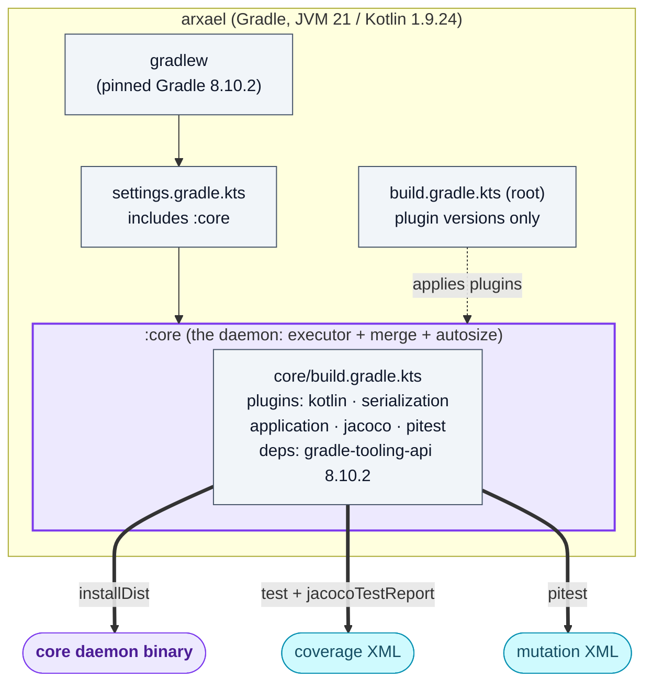
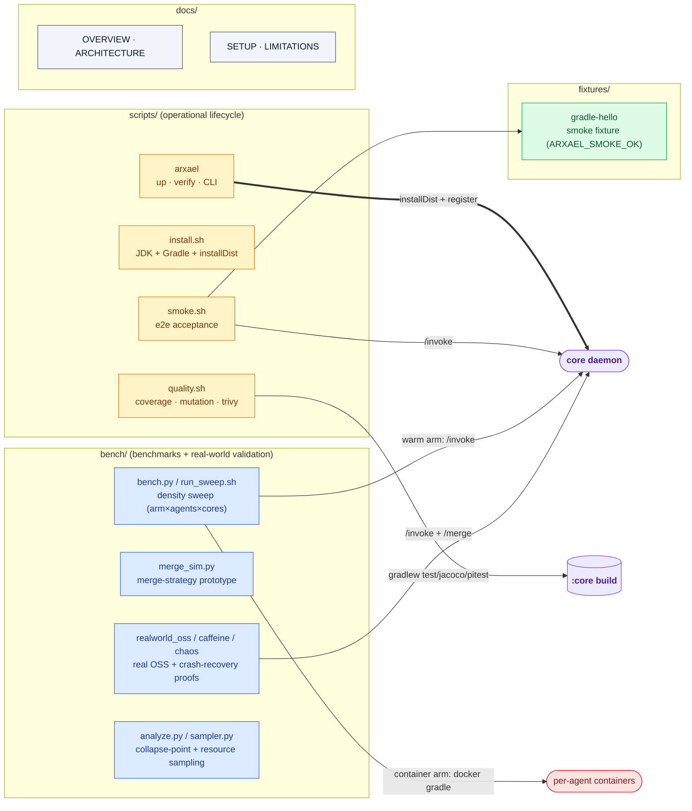
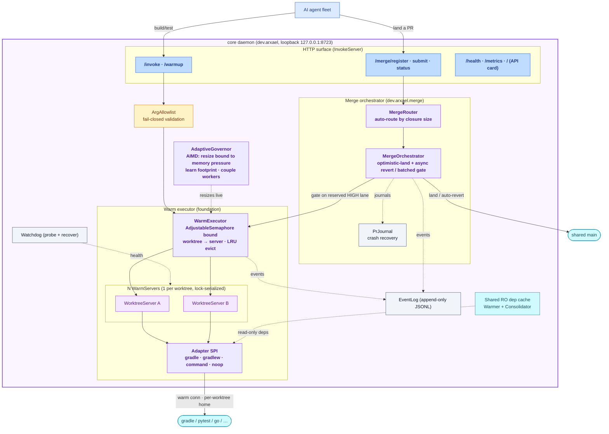
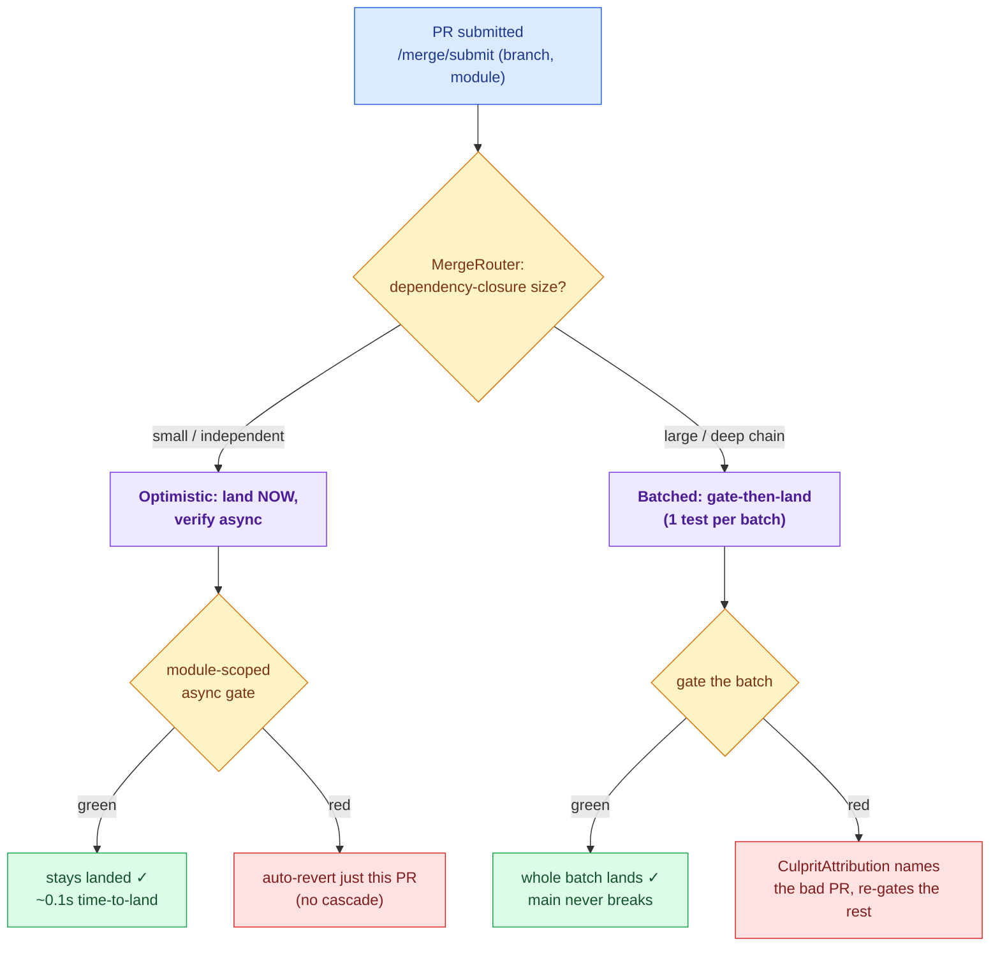

# Arxael — System Overview (meta map)

> Simplified, generated map of how the pieces fit together. The authoritative reference is
> [ARCHITECTURE.md](ARCHITECTURE.md); this doc only covers the shape.
>
> 🌐 中文版本: [OVERVIEW.zh-CN.md](OVERVIEW.zh-CN.md)

**One line:** many trusted local AI agents work on **one project** through **one warm, bounded, shared
executor** on a box you own — they branch → test → open a PR → **merge to main**, fast and without
conflicts, on a box that **sizes itself**. The win is **density** (agents-per-box before collapse),
not single-build speed.

> **Color key** used in every diagram below:
> 🔵 agents/callers · 🟡 gatekeeper/control · 🟣 build service / core · 🟢 success · 🔴 failure · ⬜ config/aux · 🟦 artifacts

---

## 0. The simple version

There are three plain ideas. Everything else is detail.

### (a) One shared build service, not one per agent

**The situation:** lots of AI coding agents are working at once. Every time one makes a change, it
has to **build and test** its code to check the change is good. Building/testing is the slow, heavy
part — it needs a program that takes time to start up and uses a lot of memory.

**How everyone else does it:** give every agent its **own private machine** that starts its own
build program from cold, every time. Fine for one or two agents. But run many at once and all those
build programs start up together → the computer runs out of memory and **everything falls over**.

**What we do:** run **one shared build service** that's already started and kept ready (so no slow
cold start). All the agents send their build/test requests to it. A **gatekeeper** only allows as
many requests at once as the computer can actually handle, so it stays fast and never falls over.

> The question that matters isn't *"how fast is one build?"* (it's the same either way) —
> it's *"how many agents can share one computer before it falls over?"*

**One build request, start to finish:**

### (b) Combining everyone's work into one project — safely

All the agents work on the **same project**, each on their own copy (a "branch"). When an agent's
change passes its tests, it asks for the change to be **added to the main shared copy**. A
**coordinator** checks the change still works *combined with everyone else's* before keeping it — and
if it breaks something, it's quietly undone so **the main copy never stops working**.

### (c) The service sizes itself

The build service watches the computer's memory while it runs. If memory gets tight it **does a bit
less at once** (so it never crashes); when there's spare room it **does more** (so the machine isn't
wasted). You don't have to tune it by hand, and it keeps working as the project grows.

---

## 0b. Beyond the executor: the workflow + adaptive layers (built on top)

The warm executor is the foundation. Two layers ride on it to make the product the full thing —
*many agents, one project, branch → test → PR → **merge to main**, fast and without conflicts, on a box
that sizes itself*. Deep dives: [ARCHITECTURE.md](ARCHITECTURE.md), [SETUP.md](SETUP.md).

- 🟣 **Merge orchestrator** (`dev.arxael.merge`, surface `/merge/{register,submit,status}`). Agents submit
  branch-tested PRs; the orchestrator lands them on a shared `main` without conflicts. It **auto-routes**
  each PR by its dependency-closure size (auto-discovered from the project's Gradle graph): small closure →
  **optimistic land + module-scoped async gate** that auto-reverts a break (instant, no cascade); large
  closure → **batched gate-then-land** that never breaks main and attributes the culprit on a red batch.
  Gate tests run on the executor's reserved high-priority lane so landings never starve behind branch-tests.

- 🟡 **Adaptive auto-sizing** (`dev.arxael.autosize`). The static box-derived bound is only a starting point;
  a governor adapts the live concurrency bound + build-workers (coupled `C·W ≈ cores`) to **measured memory
  pressure** within hard caps `[floor, ceiling]`, learns and **persists** the real per-build footprint, and
  scales the overload timeout to observed build duration. So density tracks the box's real limit AND the
  project's growth — shrinking before OOM, growing into spare capacity, both ways.

- 🟦 **Shared-but-unlocked dep cache.** Per-worktree Gradle homes are the **default** — they remove the
  cross-process cache lock (the concurrency ceiling that capped builds at ~8) but would re-download deps
  (Maven 429). So the daemon serves deps **read-only** to every per-worktree build (`GRADLE_RO_DEP_CACHE`)
  and a background **consolidator** folds freshly-downloaded deps into that shared cache — re-downloads
  converge to ~zero: shared deps, no lock, no re-download.

- 🟢 **Change-aware test scoping.** The merge gate looks at *what a PR actually changed* (its diff): a
  doc-only change (README, docs, images) **skips the gate entirely** (it can't break a test), and a code
  change is tested against only the modules it actually touches — so it doesn't re-test everything for a
  small or doc change.

---

## 1. Repo / build topology

## 2. Supporting infrastructure (around the build)

## 3. Runtime — the whole daemon (one process)

> **Rule:** concurrency comes from **N bounded warm servers, one per worktree**,
> each serialized by a lock — *never* from multiplexing one process across concurrent callers.
> Everything below lives in one long-lived process behind the loopback HTTP surface.

## 4. The merge workflow (auto-route)

> Two strategies, picked automatically per PR by its dependency-closure size. Optimistic-land gives
> the **latency**; the branch-gate + module-scoped verify give the **soundness** (main never breaks).

### Key invariants baked into the runtime
- **Per-worktree Gradle home is the default** — removes the shared-home cross-process cache lock that
  capped concurrency at ~8; the box becomes CPU-bound instead of lock-bound.
- **Shared *read-only* dep cache** (`GRADLE_RO_DEP_CACHE`) — per-worktree homes don't re-download; a
  self-filling consolidator converges re-downloads to ~zero (closes the Maven-429 blocker).
- **The concurrency bound is adaptive** — AIMD governor resizes it to measured memory pressure within
  `[floor, ceiling]`, shrinking *before* OOM and growing into spare capacity.
- **Merge auto-routes** — optimistic-land + module-scoped async revert (fast, small closures) vs batched
  gate-then-land + culprit attribution (sound, large closures); gates run on a reserved **high** lane so
  landings never starve behind branch-tests.
- **Branch-gate = soundness, optimistic-land = latency** — together: instant landings, main never broken.
- **PrJournal survives restart** — re-enqueues submitted-but-unfinished and landed-but-unverified PRs.
- **Change-aware gate** — a doc-only PR skips the gate (can't break a test); a code PR is tested against
  only the modules its diff touches, not the whole project.
- **Warm connection never closed per-invoke**; **Watchdog probes + recovers** off the hot path
  (quarantine → drop wedged → recreate fresh); **EventLog is append-only** — the replayable source of truth
  (also projected to Prometheus `/metrics`).

---

*Generated as a high-level map; component names follow `core/src/main/kotlin/dev/arxael/…`.*
