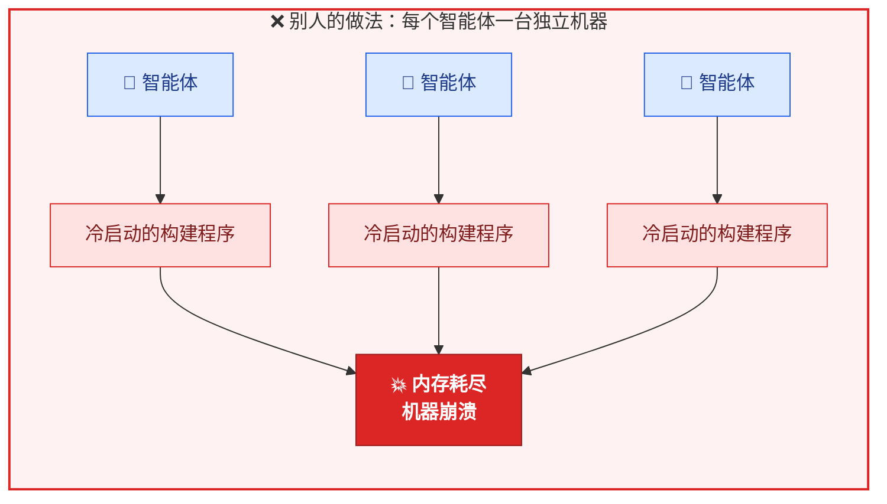
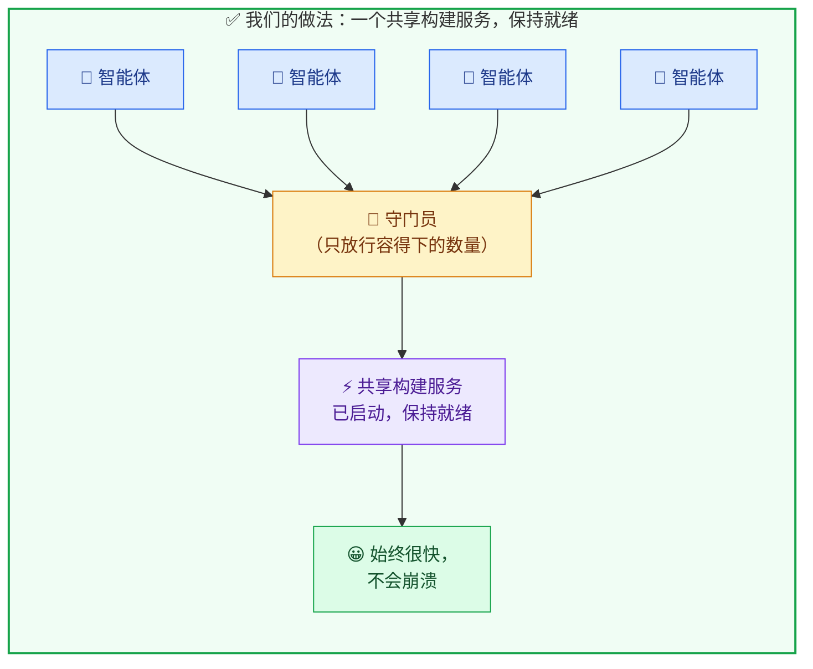
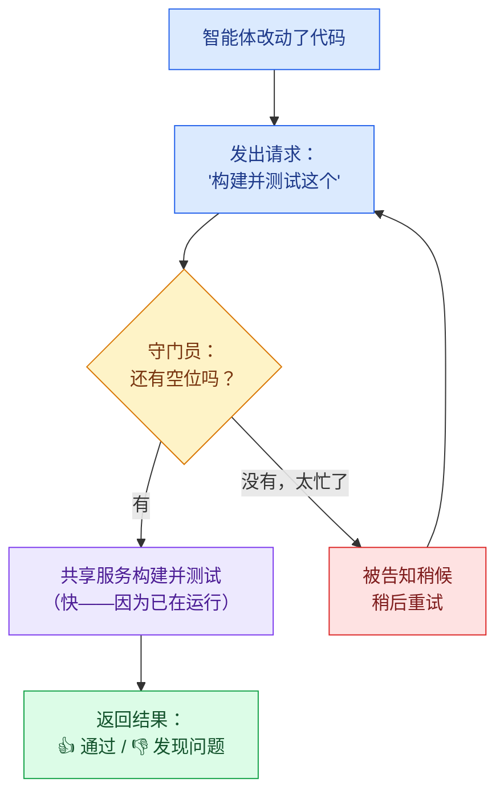
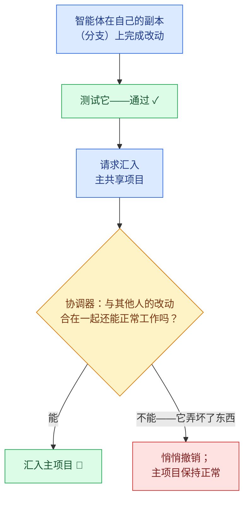
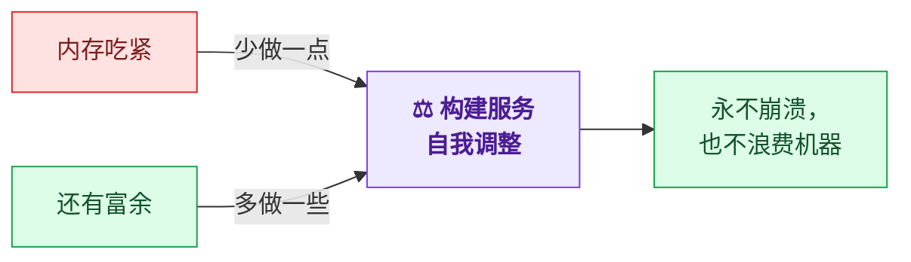
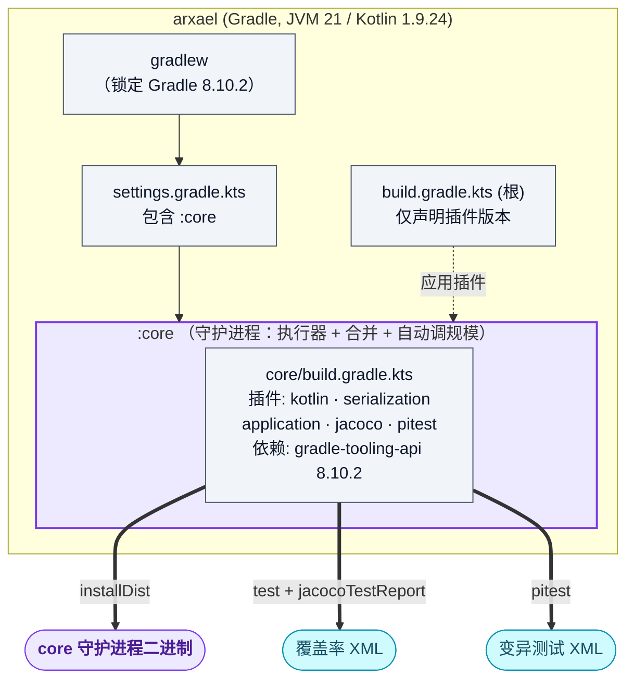
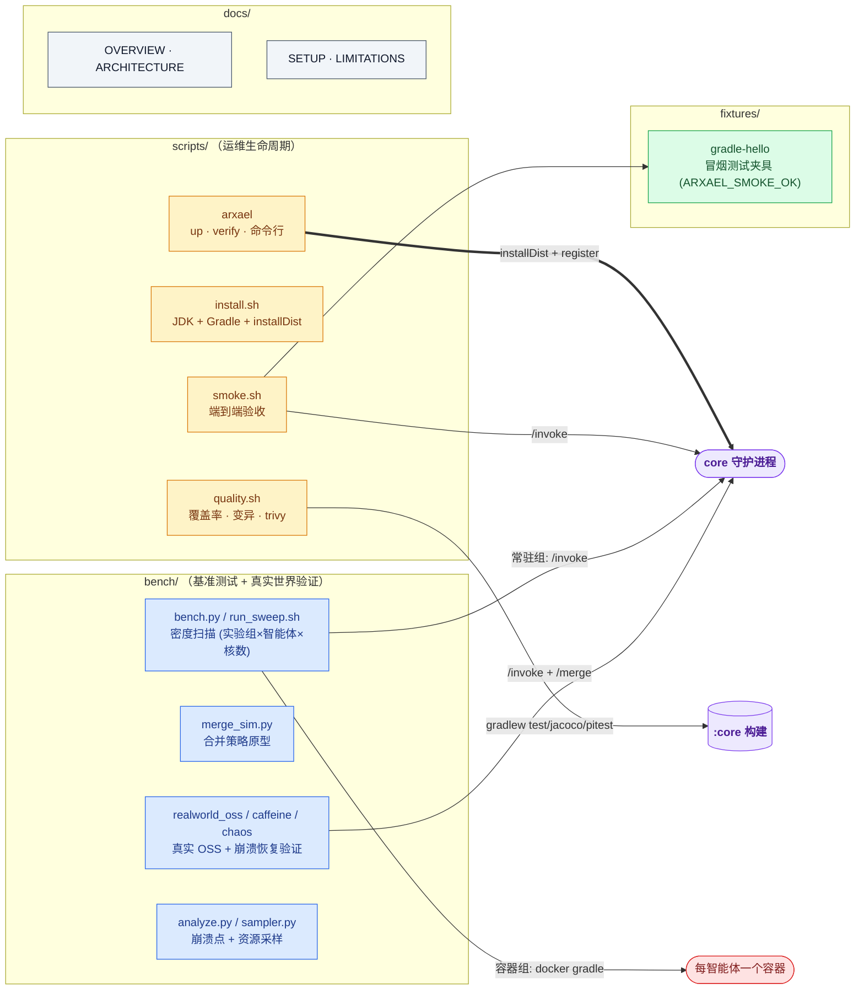
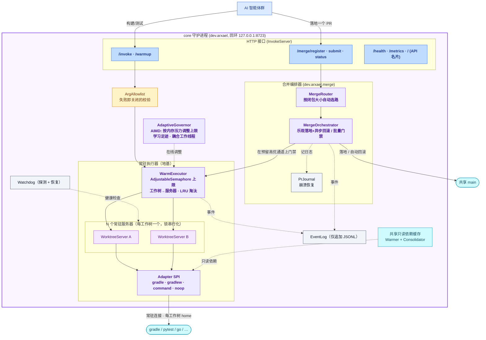
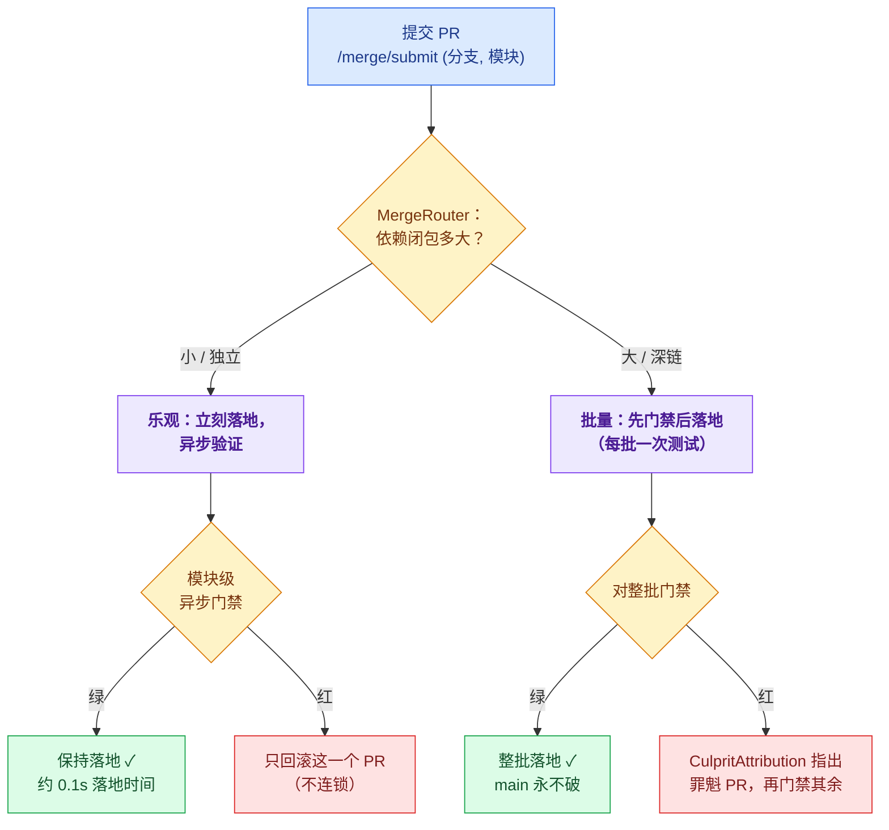

# Arxael — 系统总览（概念地图）

> 各部分如何组合在一起的简化地图（自动生成）。关于*为什么*这样做，请以
> [ARCHITECTURE.md](ARCHITECTURE.md) 为准；本文只讲结构。
>
> 🌐 English version: [OVERVIEW.md](OVERVIEW.md)

**一句话：** 让许多受信任的本地 AI 智能体（agent）在**同一个项目**上、通过运行在你自己机器上的**同一个常驻、
有限流、共享的执行器**协作——它们各自开分支 → 测试 → 提交 PR → **合并进 main**，又快又不冲突，而且机器会
**自动调整规模**。优势在于**密度**（单台机器在崩溃前能撑住多少智能体），而非单次构建的速度。

> **颜色图例**（下方每张图通用）：
> 🔵 智能体/调用方 · 🟡 守门员/管控 · 🟣 构建服务 / 核心 · 🟢 成功 · 🔴 失败 · ⬜ 配置/辅助 · 🟦 产物

---

## 0. 通俗版

一共三个朴素的想法，其余都是细节。

### (a) 一个共享的构建服务，而不是每人一个

**场景：** 很多 AI 编码智能体在同时干活。每当一个智能体改了代码，它都要**构建并测试**这段代码，
确认改动没问题。构建/测试是又慢又重的环节——它需要一个启动很慢、占用大量内存的程序。

**别人怎么做：** 给每个智能体一台**自己的独立机器**，每次都从冷状态启动自己的构建程序。
一两个智能体还好。但同时跑很多个时，所有这些构建程序一起启动 → 机器内存耗尽，**整个系统崩溃**。

**我们怎么做：** 运行**一个共享的构建服务**，它已经启动并保持就绪（所以没有缓慢的冷启动）。
所有智能体把构建/测试请求都发给它。一个**守门员**只放行机器真正能处理的请求数量，
所以系统始终很快、绝不崩溃。

> 真正重要的问题不是*“一次构建有多快？”*（两种方式都一样）——
> 而是*“一台机器在崩溃前能让多少个智能体共享？”*

**一次构建请求，从头到尾：**

### (b) 把每个人的工作安全地汇入同一个项目

所有智能体都在**同一个项目**上干活，各自有一份自己的副本（一个“分支”）。当一个智能体的改动通过测试后，
它会请求把这个改动**汇入主共享副本**。一个**协调器**会先检查这个改动*与其他人的改动合在一起*是否仍然能正常工作，
然后才保留它——如果它弄坏了什么，就会被悄悄撤销，所以**主副本永远不会停止工作**。

### (c) 服务会自动调整规模

构建服务在运行时会一直盯着机器的内存。如果内存吃紧，它就**一次少做一点**（这样永远不会崩溃）；
如果还有富余，它就**多做一些**（这样不浪费机器）。你不用手动去调它，而且随着项目变大它也照样能撑住。

---

## 0b. 执行器之上：工作流层 + 自适应层（建于其上）

常驻执行器是地基。两层建于其上，让产品成为完整形态——*许多智能体、一个项目，开分支 → 测试 → PR →
**合并进 main**，又快又不冲突，且机器自动调整规模*。深入阅读：[ARCHITECTURE.md](ARCHITECTURE.md)、[SETUP.md](SETUP.md)。

- 🟣 **合并编排器（Merge orchestrator）**（`dev.arxael.merge`，接口 `/merge/{register,submit,status}`）。
  智能体提交经过分支测试的 PR；编排器把它们无冲突地落到共享的 `main` 上。它按每个 PR 的**依赖闭包大小**
  （从项目的 Gradle 图自动发现）**自动选路**：闭包小 → **乐观落地 + 模块级异步门禁**，一旦出错就自动回滚
  （即时、不连锁）；闭包大 → **批量先门禁后落地**，永不弄坏 main，并在某批变红时归因到罪魁 PR。
  门禁测试跑在执行器**预留的高优先级通道**上，因此落地永远不会被分支测试饿死。

- 🟡 **自适应自动调整规模（Adaptive auto-sizing）**（`dev.arxael.autosize`）。由机器静态推导的上限只是个起点；
  一个调速器（governor）在硬性上下界 `[floor, ceiling]` 内，根据**实测内存压力**调整在线并发上限 + 构建工作线程数
  （二者耦合 `C·W ≈ 核数`），学习并**持久化**真实的单次构建内存足迹，并按观测到的构建时长缩放过载超时。
  于是密度既跟得上机器的真实极限，也跟得上项目的增长——内存吃紧前先收缩，有富余时再增长，双向自适应。

- 🟦 **共享但无锁的依赖缓存。** 每工作树独立的 Gradle home 现在是**默认**——它去掉了跨进程缓存锁
  （把构建数卡在约 8 个的并发天花板），但会导致重复下载依赖（Maven 429）。于是守护进程以**只读**方式
  （`GRADLE_RO_DEP_CACHE`）把依赖供给每个每工作树构建，并由一个后台**整合器（consolidator）**把新下载的
  依赖折叠进该共享缓存——重复下载收敛到约零：依赖共享、无锁、不重复下载。

- 🟢 **变更感知的测试范围。** 合并门禁会看 PR *实际改了什么*（它的 diff）：只改文档（README、docs、图片）
  的 PR **完全跳过门禁**（不可能弄坏测试），而代码改动只针对它真正触及的模块来测——不会为一个小改动或文档
  改动去重测整个项目。

---

## 1. 仓库 / 构建拓扑

## 2. 配套基础设施（围绕构建）

## 3. 运行时——整个守护进程（单一进程）

> **规则：** 并发来自 **N 个有限流的常驻服务器，每个工作树（worktree）一个**，
> 每个都由锁串行化——*绝不*靠让单个进程同时服务多个并发调用方来实现并发。
> 下面的一切都活在同一个常驻进程里，藏在回环 HTTP 接口之后。

## 4. 合并工作流（自动选路）

> 两种策略，按每个 PR 的依赖闭包大小自动挑选。乐观落地带来**低延迟**；
> 分支门禁 + 模块级验证带来**正确性**（main 永不破）。

### 烙进运行时的关键不变量
- **每工作树独立的 Gradle home 现为默认**——去掉了把并发卡在 ~8 的共享 home 跨进程缓存锁；
  机器从“被锁限制”变为“被 CPU 限制”。
- **共享*只读*依赖缓存**（`GRADLE_RO_DEP_CACHE`）——每工作树 home 不重复下载；自填充的 consolidator
  让重复下载收敛到 ~0（关闭 Maven-429 阻塞点）。
- **并发上限是自适应的**——AIMD 调速器在 `[floor, ceiling]` 内按实测内存压力调整它，OOM 前先收缩、有富余时再增长。
- **合并自动选路**——乐观落地 + 模块级异步回滚（小闭包，快） vs 批量先门禁后落地 + 罪魁归因（大闭包，稳）；
  门禁跑在预留的**高优**通道上，落地永不被分支测试饿死。
- **分支门禁 = 正确性，乐观落地 = 低延迟**——二者合一：即时落地，main 永不破。
- **变更感知门禁**——只改文档的 PR 跳过门禁（不可能弄坏测试）；代码 PR 只针对其 diff 触及的模块来测，
  而非整个项目。
- **PrJournal 能扛重启**——重新入队“已提交但未完成”和“已落地但未验证”的 PR。
- **常驻连接绝不在每次调用后关闭**；**Watchdog 探测并在热路径之外恢复**（隔离 → 丢弃卡死连接 → 重建全新）；
  **EventLog 仅追加**——可重放的事实来源（同时投射到 Prometheus `/metrics`）。

---

*作为高层地图生成；组件名对应 `core/src/main/kotlin/dev/arxael/…`。*
